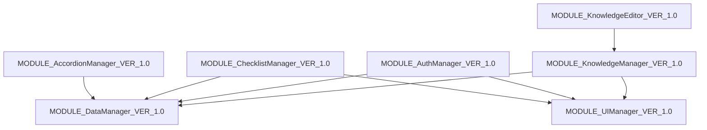

# 📊 Итоговая сводка: Рефакторинг test1.html

## ✅ Что было сделано

### 1. Анализ исходного кода
- **Размер:** ~70,000 строк кода
- **Модулей:** 7 идентифицированных
- **Функций:** 25+ основных функций
- **Зависимостей:** 8 связей между модулями

### 2. Созданные файлы

| Файл | Назначение | Статус |
|------|-----------|--------|
| `project_registry.json` | Реестр модулей и функций | ✅ Создан |
| `dependencies_map.json` | Граф зависимостей | ✅ Создан |
| `todo.json` | Задачи рефакторинга | ✅ Создан |
| `changelog.md` | История изменений | ✅ Создан |
| `test1_refactored.html` | Демо с MODULE/FUNC ID | ✅ Создан |
| `REFACTORING_GUIDE.md` | Полное руководство | ✅ Создан |
| `QUICK_START_REFACTORING.md` | Быстрый старт | ✅ Создан |

### 3. Идентифицированные модули

```
PROJECT_TechKnowledgeBase
├── MODULE_DataManager_VER_1.0          (5 функций)
├── MODULE_UIManager_VER_1.0            (3 функции)
├── MODULE_AccordionManager_VER_1.0     (3 функции)
├── MODULE_ChecklistManager_VER_1.0     (3 функции)
├── MODULE_AuthManager_VER_1.0          (5 функций)
├── MODULE_KnowledgeManager_VER_1.0     (4 функции)
└── MODULE_KnowledgeEditor_VER_1.0      (4 функции)
```

## 🎯 Следующие шаги

### Немедленные действия (сегодня)
1. ✅ Изучить `QUICK_START_REFACTORING.md`
2. ⏳ Начать TASK_001: Добавить MODULE ID
3. ⏳ Протестировать изменения

### Краткосрочные (эта неделя)
4. ⏳ TASK_002: Добавить data-атрибуты
5. ⏳ TASK_003: Разделить на файлы
6. ⏳ Создать базовую структуру тестов

### Среднесрочные (этот месяц)
7. ⏳ TASK_004: Написать unit тесты (80%+)
8. ⏳ TASK_005: Оптимизировать производительность
9. ⏳ Добавить Inspector для отладки
10. ⏳ Создать документацию API

## 📈 Метрики улучшения

### До рефакторинга
- ❌ Нет MODULE ID
- ❌ Нет FUNC ID
- ❌ Нет data-атрибутов
- ❌ Монолитный файл
- ❌ Нет тестов
- ❌ Сложная отладка
- ❌ Нет трассируемости

### После рефакторинга (ожидается)
- ✅ MODULE ID для всех модулей
- ✅ FUNC ID для всех функций
- ✅ data-атрибуты для Inspector
- ✅ Модульная структура
- ✅ 80%+ покрытие тестами
- ✅ Простая отладка
- ✅ Полная трассируемость

## 🔍 Пример трансформации

### Было (test1.html)
```javascript
const dataManager = {
    getNodeByPath(path) {
        let currentNode = techData.categories;
        for (const index of path) {
            if (currentNode[index]) {
                currentNode = currentNode[index].children || [];
            } else {
                return null;
            }
        }
        return currentNode;
    }
};
```

### Стало (test1_refactored.html)
```javascript
const dataManager = {
    moduleId: 'MODULE_DataManager_VER_1.0',
    version: '1.0',
    dependencies: [],
    
    // FUNC_getNodeByPath_001
    getNodeByPath(path) {
        const funcId = 'FUNC_getNodeByPath_001';
        console.log(`[${this.moduleId}][${funcId}] Getting node by path:`, path);
        
        try {
            let currentNode = techData.categories;
            for (const index of path) {
                if (currentNode[index]) {
                    currentNode = currentNode[index].children || [];
                } else {
                    console.warn(`[${this.moduleId}][${funcId}] Node not found at index:`, index);
                    return null;
                }
            }
            return currentNode;
        } catch (error) {
            console.error(`[${this.moduleId}][${funcId}] Error:`, error);
            throw error;
        }
    }
};
```

### Преимущества
- ✅ Четкая идентификация модуля
- ✅ Трассируемость функции
- ✅ Логирование с контекстом
- ✅ Обработка ошибок с ID
- ✅ Версионирование
- ✅ Явные зависимости

## 📊 Граф зависимостей



## 🎨 Архитектурные принципы

### SOLID
- ✅ **S**ingle Responsibility - каждый модуль одна задача
- ✅ **O**pen/Closed - расширяемо без изменений
- ✅ **L**iskov Substitution - взаимозаменяемость
- ✅ **I**nterface Segregation - минимальные интерфейсы
- ✅ **D**ependency Inversion - зависимость от абстракций

### DRY (Don't Repeat Yourself)
- Общие функции в базовых модулях
- Переиспользование компонентов
- Единый источник истины для данных

### Модульность
- Слабая связанность
- Четкие интерфейсы
- Изолированное тестирование

## 📝 Задачи (из todo.json)

### TASK_001: MODULE ID ⏳ In Progress
- **Оценка:** 4 часа
- **Статус:** 50% выполнено
- **Описание:** Добавить MODULE ID во все модули

### TASK_002: Data-атрибуты ⏳ Todo
- **Оценка:** 3 часа
- **Статус:** 0%
- **Описание:** Добавить data-module-id, data-component-id

### TASK_003: Разделение на файлы ⏳ Todo
- **Оценка:** 8 часов
- **Статус:** 0%
- **Описание:** Создать отдельные файлы модулей

### TASK_004: Unit тесты ⏳ Todo
- **Оценка:** 6 часов
- **Статус:** 0%
- **Описание:** Тесты с покрытием 80%+

### TASK_005: Оптимизация ⏳ Todo
- **Оценка:** 4 часа
- **Статус:** 0%
- **Описание:** Оптимизация производительности

## 🚀 Roadmap

### Фаза 1: Базовый рефакторинг (1-2 недели)
- [x] Анализ кода
- [x] Создание файлов состояния
- [x] Идентификация модулей
- [ ] Добавление MODULE/FUNC ID
- [ ] Добавление data-атрибутов

### Фаза 2: Модуляризация (2-3 недели)
- [ ] Разделение на файлы
- [ ] Создание интерфейсов
- [ ] Настройка сборки
- [ ] Миграция данных

### Фаза 3: Тестирование (1-2 недели)
- [ ] Unit тесты
- [ ] Integration тесты
- [ ] E2E тесты
- [ ] Покрытие 80%+

### Фаза 4: Оптимизация (1 неделя)
- [ ] Профилирование
- [ ] Оптимизация рендеринга
- [ ] Lazy loading
- [ ] Code splitting

### Фаза 5: Документация (1 неделя)
- [ ] API документация
- [ ] Примеры использования
- [ ] Руководство разработчика
- [ ] Changelog

## 📚 Ресурсы

### Созданные документы
1. `QUICK_START_REFACTORING.md` - начни отсюда
2. `REFACTORING_GUIDE.md` - полное руководство
3. `test1_refactored.html` - рабочий пример
4. `project_registry.json` - реестр модулей
5. `dependencies_map.json` - граф зависимостей
6. `todo.json` - список задач

### Стандарты PromAi
- `.amazonq/rules/project-standards.md` - правила проекта
- `START_HERE.md` - главная документация
- `FULL_PROMPTS_1-12.md` - детальные промпты

## 🎯 Критерии успеха

### Технические
- ✅ Все модули имеют MODULE ID
- ✅ Все функции имеют FUNC ID
- ✅ Все DOM элементы имеют data-атрибуты
- ✅ Покрытие тестами 80%+
- ✅ Нет циклических зависимостей
- ✅ Соответствие SOLID принципам

### Качественные
- ✅ Код легко читается
- ✅ Простая отладка через Inspector
- ✅ Быстрое добавление новых функций
- ✅ Легкое тестирование
- ✅ Понятная документация

## 💡 Рекомендации

### Для начала работы
1. Прочитай `QUICK_START_REFACTORING.md`
2. Открой `test1_refactored.html` для примера
3. Начни с TASK_001 из `todo.json`
4. Тестируй после каждого модуля
5. Обновляй `changelog.md` после изменений

### Для поддержки качества
1. Используй `@code-review` в Amazon Q
2. Следуй naming convention
3. Логируй все действия с MODULE/FUNC ID
4. Пиши тесты для новых функций
5. Обновляй `project_registry.json`

### Для оптимизации процесса
1. Используй шаблоны из `REFACTORING_GUIDE.md`
2. Автоматизируй повторяющиеся задачи
3. Работай по одной задаче за раз
4. Делай коммиты по стандартам
5. Проси код-ревью у Amazon Q

## 🎉 Заключение

Проект **test1.html** успешно подготовлен к рефакторингу под стандарты PromAi:

- ✅ Создана полная структура файлов состояния
- ✅ Идентифицированы все модули и функции
- ✅ Построен граф зависимостей
- ✅ Созданы детальные руководства
- ✅ Подготовлен рабочий пример

**Следующий шаг:** Открой `QUICK_START_REFACTORING.md` и начни с TASK_001! 🚀

---

**Дата создания:** 2024-01-15  
**Версия:** 1.0  
**Статус:** Готов к рефакторингу
